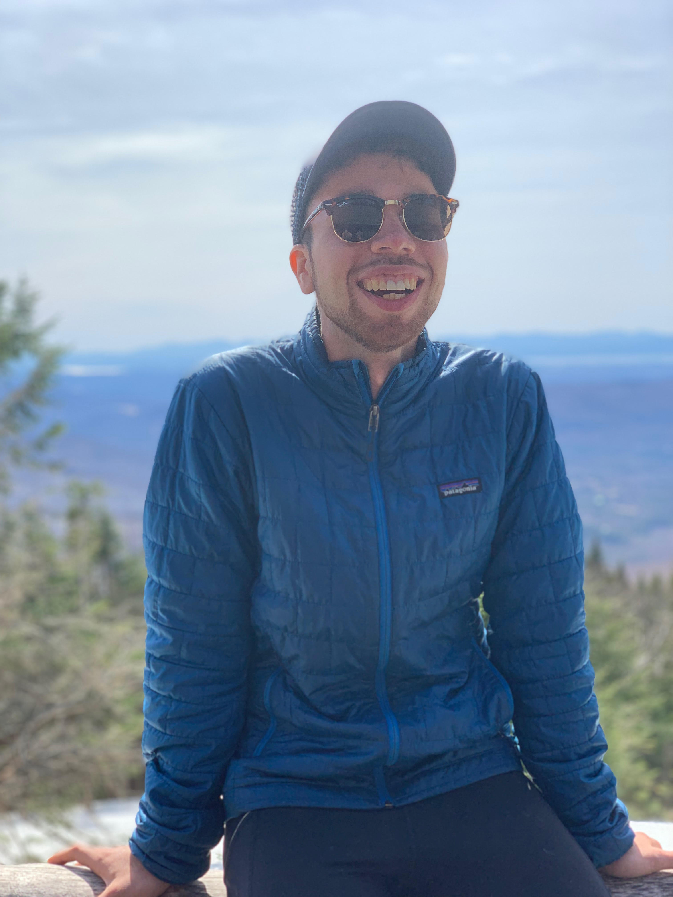

---
---
 

# **About Me**

I am an environmental engineer who is passionate about maintaining and improving ecosystems within the Philadelphia region through risk management and long term planning of built and natural environments. I currenly work in city government where I utilize coding, data analysis, and holistic engineering and economic assesments of wastewater treatment facilities to maintain and improve the health of the Delaware River Estuary. In addition, I seek to provide my department's diverse community of customers with equitable service.

I attended undergrad at the University of Vermont where I obtained a B.S. in Environmental Engineering and developed my passions for climate change modeling and adaptation, nuanced wastewater treatment facility design, and engineering ethics. My undergraduate education included several humanities courses that provided a unique balance and perspective to my engineering studies.

I am currenly interested in pursing graduate work in both Water Resources Engineering and Public Policy. 

